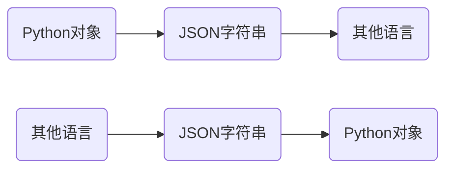
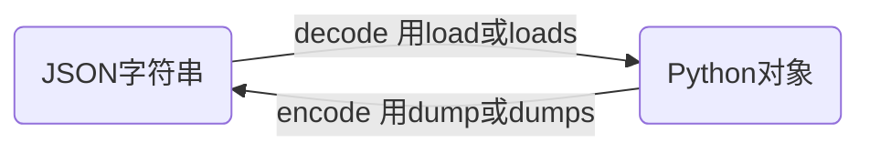
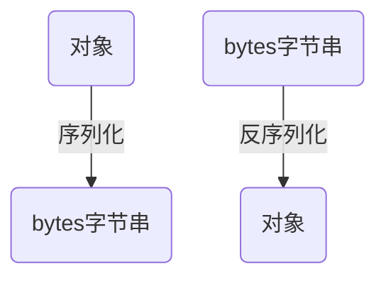

## `JSON`

`JSON`的全称`JavaScript Object Notation`，即`JavaScript`对象符号，它是一种轻量级的**数据交换格式**，`JSON`格式被广泛用于各种语言的**数据交换**中，在不同的编程语言之间传递对象。



## Python的`JSON`支持

`json`模块提供了对`JSON`的支持，他既包含了将`JSON`字符串恢复成Python对象的函数，也提供了将Python对象转换成`JSON`字符串的函数。


`json`模块中常用函数与功能：

- `json.dump(obj,fp)`：将`obj`对象转换成`JSON`字符串输出到`fp`流中，`fp`是一个支持`write()`方法的类文件对象。(这里简化了`dump()`方法的参数，下面几个方法都简化了参数)

- `json.dumps(obj)`：将`obj`对象转换为`JSON`字符串,并返回该`JSON`字符串。
- `json.load(fp)`：从`fp`流读取`JSON`字符串，将其恢复成Python对象，其中`fp`是一个支持`write()`方法的类文件对象。
- `json.loads(s)`：将`JSON`字符串`s`恢复成Python对象。

这里注意一下`json.dump()`与`json.dumps()`函数的区别，后面的`s`表示`string`字符串。同理`json.load()`与`json.loads()`也一样。



```python
# json.dump与json.dumps函数的使用案例
import json
# 将Python对象转JSON字符串（元组会当成数组）
s = json.dumps(['yeeku', {'favorite': ('coding', None, 'game', 25)}])
print(s)  # ["yeeku", {"favorite": ["coding", null, "game", 25]}]
print(type(s)) #<class 'str'>

# 简单的Python字符串转JSON
s2 = json.dumps("\"foo\bar")
print(s2)  # "\"foo\bar"
print(type(s2)) #<class 'str'>

# 简单的Python字符串转JSON
s3 = json.dumps('\\')
print(s3)  # "\\"
print(type(s3)) #<class 'str'>

# Python的dict对象转JSON，并对key排序
s4 = json.dumps({"c": 0, "b": 0, "a": 0}, sort_keys=True)
print(s4)  # {"a": 0, "b": 0, "c": 0}
print(type(s4)) #<class 'str'>

# 将Python列表转JSON
# 并指定JSON分隔符：逗号和冒号之后没有空格（默认有空格）
s5 = json.dumps([1, 2, 3, {'x': 5, 'y': 7}], separators=(',', ':'))
# 输出的JSON字符串中逗号和冒号之后没有空格
print(s5)  # [1,2,3,{"x":5,"y":7}]
print(type(s5)) #<class 'str'>

# 指定indent为4，意味着转换的JSON字符串有缩进
s6 = json.dumps({'Python': 5, 'Kotlin': 7}, sort_keys=True, indent=4)
print(s6)
print(type(s6))
'''
{
    "Kotlin": 7,
    "Python": 5
}
<class 'str'>
'''

# 使用JSONEncoder的encode方法将Python转JSON
s7 = json.JSONEncoder().encode({"names": ("孙悟空", "齐天大圣")})
print(s7)  # {"names": ["\u5b59\u609f\u7a7a", "\u9f50\u5929\u5927\u5723"]}
print(type(s7)) #<class 'str'>

f = open('a.json', 'w')
# 使用dump()函数将转换得到JSON字符串输出到文件
json.dump(['Kotlin', {'Python': 'excellent'}], f)
```

```python
#json.load与json.loads函数使用案例
import json
# 将JSON字符串恢复成Python列表
result1 = json.loads('["yeeku", {"favorite": ["coding", null, "game", 25]}]')
print(result1)  # ['yeeku', {'favorite': ['coding', None, 'game', 25]}]
print(type(result1))  # <class 'list'>

# 将JSON字符串恢复成Python字符串
result2 = json.loads('"\\"foo\\"bar"')
print(result2)  # "foo"bar
print(type(result2))  # <class 'str'>

# 定义一个自定义的转化函数
def as_complex(dct):
    #{'__complex__': True, 'real': 1, 'imag': 2}
    print(dct)
    if '__complex__' in dct:
        return complex(dct['real'], dct['imag'])
    
    #如果dct字典中没有'__complex__'key则会返回dct字典
    return dct


# 使用自定义的恢复函数
# 自定义回复函数将real数据转成复数的实部，将imag转成复数的虚部
result3 = json.loads('{"__complex__": true, "real": 1, "imag": 2}',
                     object_hook=as_complex)
print(result3)  # (1+2j)
print(type(result3))  # <class 'complex'>

f = open('a.json')
# 从文件流恢复JSON列表
result4 = json.load(f)
print(result4)  # ['Kotlin', {'Python': 'excellent'}]
print(type(result4)) #<class 'list'>
```


## 序列化

我们把变量从内存中变成可存储或传输的过程称之为序列化，在Python中叫`pickling`，在其他语言中也被称之为`serialization`，`marshalling`，`flattening`等等，都是一个意思。


序列化之后，就可以把序列化后的内容写入磁盘，或者通过网络传输到别的机器上。

反过来，把变量内容从序列化的对象重新读到内存里称之为反序列化，即`unpickling`。



Python提供了`pickle`模块来实现序列化。

`pickle.dumps()`方法把任意对象序列化成一个`bytes`，然后把这个`bytes`写入文件。或者用另一个方法`pickle.dump()`直接把对象序列化后写入一个`file-like Object`(类文件对象)：

```python
import pickle

class Football():
    def __init__(self,name,age,score):
        self.name=name
        self.age=age
        self.score=score

d=Football(name='Bob',age=20,score=88)
a=pickle.dumps(d)
print(a) 
print(type(a)) #<class 'bytes'>

f=open('dump.txt','wb')
pickle.dump(d,f)
f.close()
```


当我们要把对象从磁盘读到内存时，可以先把内容读到一个`bytes`，然后用`pickle.loads()`方法反序列化出对象，也可以直接用`pickle.load()`方法从一个`file-like Object`(类文件对象)中直接反序列化出对象。我们打开另一个Python命令行来反序列化刚才保存的对象：

```python
import pickle
#对类定义一定要留下,否则反序列化出来的对象会报错
class Football():
    def __init__(self,name,age,score):
        self.name=name
        self.age=age
        self.score=score

#将bytes字节串反序列化为Football对象
a=pickle.loads(b'\x80\x03c__main__\nFootball\nq\x00)\x81q\x01}q\x02(X\x04\x00\x00\x00nameq\x03X\x03\x00\x00\x00Bobq\x04X\x03\x00\x00\x00ageq\x05K\x14X\x05\x00\x00\x00scoreq\x06KXub.')
print(a)#<__main__.Football object at 0x03559970>
print(type(a))#class '__main__.Football'>

f=open('dump.txt','rb')
#直接从文件对象中将bytes字节串反序列化为Football对象
d=pickle.load(f)
print(d)#<__main__.Football object at 0x035593F0>
print(type(d))#<class '__main__.Football'>
f.close()
```

