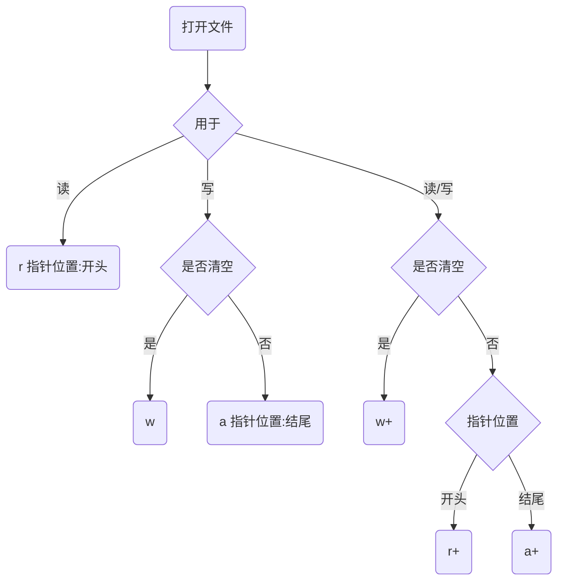
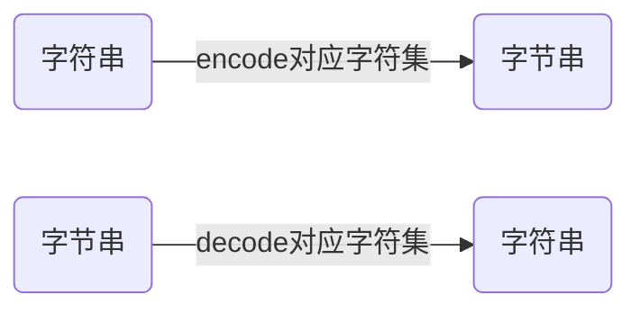

## 

I/O编程中，Stream（流）是一个很重要的概念，可以把流想象成一个水管，数据就是水管里的水，但是只能单向流动。Input Stream就是数据从外面（磁盘、网络）流进内存，Output Stream就是数据从内存流到外面去。


## 同步I/O与异步I/O

由于CPU和内存的速度远远高于外设的速度，所以，在I/O编程中，就存在速度严重不匹配的问题。 举个例子来说，比如要把100M的数据写入磁盘，CPU输出100M的数据只需要0.01秒，可是磁盘要接收这100M数据可能需要10秒，怎么办呢？有两种办法：

第一种是CPU等着，也就是程序暂停执行后续代码，等100M的数据在10秒后写入磁盘，再接着往下执行，这种模式称为同步IO；

另一种方法是CPU不等待，只是告诉磁盘，“您老慢慢写，不着急，我接着干别的事去了”，于是，后续代码可以立刻接着执行，这种模式称为异步IO。

同步和异步的区别就在于是否等待IO执行的结果。好比你去麦当劳点餐，你说“来个汉堡”，服务员告诉你，对不起，汉堡要现做，需要等5分钟，于是你站在收银台前面等了5分钟，拿到汉堡再去逛商场，这是同步IO。

你说“来个汉堡”，服务员告诉你，汉堡需要等5分钟，你可以先去逛商场，等做好了，我们再通知你，这样你可以立刻去干别的事情（逛商场），这是异步IO。

很明显，使用异步IO来编写程序性能会远远高于同步IO，但是异步IO的缺点是编程模型复杂。想想看，你得知道什么时候通知你“汉堡做好了”，而通知你的方法也各不相同。如果是服务员跑过来找到你，这是回调模式，如果服务员发短信通知你，你就得不停地检查手机，这是轮询模式。总之，异步IO的复杂度远远高于同步IO。

操作IO的能力都是由操作系统提供的，每一种编程语言都会把操作系统提供的低级C接口封装起来方便使用，Python也不例外。


## Python文件I/O

python关于文件I/O，一般会用到`pathlib`模块和`os.path`模块来对路径进行操作，全局`open()`函数来打开文件进行读写。


### `pathlib`模块操作目录

`pathlib`模块提供了一组面向对象的类，这些类可代表各种操作系统上的路径，程序可通过这些类操作路径。


**`UNIX`风格的路径和`Windows`风格的路径的主要区别在于根路径和路径分隔符：`UNIX`风格的路径的路径的根路径是正斜杠(/)，而`Windows`风格的路径的根路径是盘符(c:)；`UNIX`风格的路径的分隔符是正斜杠(/)，而`Windows`风格的路径的分隔符是反斜杠(\)。**


`PurePath`：代表并不访问实际文件系统的"纯路径"。`PurePath`只负责对路径字符串执行操作，至于字符串是否对应实际的路径，它并不关心。

`Path`：代表访问实际文件系统的"真正路径"。`Path`对象可用于判断对应的文件是否存在、是否为文件、是否为目录等。


### `PurePath`类的使用

**在创建`PurePath`时传入的参数包含多个跟路径时：**

- 在`UNIX`系统下，最后一个根路径及后面的子路径生效。
- 在`Windows`系统下，如果最后一个盘符后面有以正斜杠或反斜杠开头的子路径则以该盘符和以正斜杠或反斜杠开头的子路径生效；如果最后一个盘符后面没有以正斜杠或反斜杠开头的子路径，则盘符及后面的子路径生效。

```python
from pathlib import *
pp = PurePath('crazyit', 'some/path', 'info')
# 看到输出Windows风格的路径
print(pp) # 'crazyit\some\path\info'

# 如果传入参数包含多个根路径,
#在UNIX系统下最后一个根路径及后面子路径生效
pp = PurePosixPath('/etc', '/usr', 'lib64')
print(pp) # /usr/lib64
pp = PureWindowsPath('c:/Windows', 'd:info','lib')
print(pp) # d:info\lib  

#这里要特别留意,这个路径组合很特别
# 在Windows风格路径中，只有盘符才算根路径
pp = PureWindowsPath('c:/Windows', '/Program Files','lib')
print(pp) # c:\Program Files\lib

```


### `Path`类的使用

`Path`包含一个很常用的`iterdir()`方法，该方法可返回`Path`对应目录下的所有子目录和文件。

`Path`还包含`glob()`方法，用于获取`Path`对应目录及其子目录下匹配指定模式的所有文件。

```python
from pathlib import *
# 获取当前目录
p = Path('.')
# 遍历当前目录下所有文件和子目录
for x in p.iterdir():
    print(x)
    
# 获取上一级目录
p = Path('../')
# 获取上级目录及其所有子目录下的的py文件
# **语法表示当前目录及其子目录
for x in p.glob('**/*.py'):
    print(x)
    
# 获取g:/publish/codes对应的目录
p = Path('g:/publish/codes')
# 获取g:/publish/codes目录及其所有子目录下的的py文件
for x in p.glob('**/Path_test1.py'):
    print(x)
```


### `fnmatch`处理文件名匹配

`fnmatch.fnmatch(filename,pattern)`：判断指定文件名是否匹配指定的`pattern`。

`fnmatch.filter(names,pattern)`：该函数对`names`列表进行过滤，返回`names`列表中匹配`pattern`的文件名组成的子集合。

```python
from pathlib import *
import fnmatch

# 遍历当前目录下所有文件和子目录
for file in Path('.').iterdir():
    # 访问所有以_test.py结尾的文件
    if fnmatch.fnmatch(file, '*_test.PY'):
        print(file)

names = ['a.py', 'b.py', 'c.py', 'd.py']
# 对names列表进行过滤
sub = fnmatch.filter(names, '[ac].py')
print(sub) # ['a.py', 'c.py']
```


## `open()`函数打开文件

Python提供内置`open()`函数用于打开指定文件。

`open(filename [,access_mode] [,buffering])`

参数`filename`代表要打开的文件路径；`access_mode`表示文件打开的模式；`buffering`表示打开文件是否启用缓冲。

1. 如果为0(`False`)，那么该函数打开的文件就是不带缓冲的；
2. 如果是1(`True`)，那么带缓冲打开文件，执行I/O时性能将会更好；
3. 如果为大于1的整数，则该整数用于指定缓冲区大小(单位是字节)；
4. 如果为任何负数，则代表使用默认的缓冲区大小。


该函数返回的文件对象有如下属性：

- `file.closed`：该属性返回文件是否已经关闭
- `file.mode`：该属性返回被打开文件的访问模式
- `file.name`：该属性返回文件的名称

```python
# 以默认方式打开文件
f = open('open_test.py')
# 访问文件的编码方式
print(f.encoding) # cp936
# 访问文件的访问模式
print(f.mode) # r
# 访问文件是否已经关闭
print(f.closed) # False
# 访问文件对象打开的文件名
print(f.name) # open_test.py
```


### 文件打开模式

| **模式** |                           **意义**                           |
| :------: | :----------------------------------------------------------: |
|   `r`    |                           只读模式                           |
|   `w`    |                            写模式                            |
|   `a`    |                           追加模式                           |
|   `+`    | 读写模式，可与其他模式结合使用。比如`r+`代表读写模式，`w+`也代表读写模式 |
|   `b`    | 二进制模式，可与其他模式结合。比如`rb`二进制只读模式，`rb+`二进制读写模式，`ab`二进制追加模式 |



当以模式`w`或者`w+`打开文件时，`open()`函数都会立即清空文件内容。


### 读取文件

#### 按字节或字符读取

对于计算机中的文件来说，文本文件只有很少一部分，大部分文件其实都是二进制文件，包括图片文件、音频文件、视频文件等。

文件对象提供了`read()`方法来按字节或字符读取文件内容，到底是读取字节还是字符，取决于是否用了`b`模式，如果使用了`b`模式，则每次读取一个字节；如果没有使用`b`模式，则每次读取一个字符。在调用该方法时，可传入一个整数作为参数，用于指定最多读取多少个字节或字符。如果在调用`read()`方法时不传入参数，该方法默认会读取全部文件内容。

**当`open()`函数打开文本文件时，程序总是使用当前操作系统的字符集，比如`Windows`平台，`open()`函数总是使用`GBK`字符集。**

```python
#默认是采用GBK,因此.txt文件需要用GBK编码保存,读取出来的文件才不会乱码
f = open("test.txt", 'r', True)
while True:
    # 每次读取一个字符
    ch = f.read(1)
    # 如果没有读到数据，跳出循环
    if not ch: break
    # 输出ch
    print(ch, end='')
f.close()
```


**如果要读取的文件所使用的字符集和当前操作系统的字符集不匹配，有两种解决方式：**

1. 使用二进制模式读取，然后用`bytes`的`decode()`方法恢复成字符串；
2. 利用`codecs`模块的`open()`函数来打开文件，该函数在打开文件时允许指定字符集。

```python
# 指定使用二进制方式读取文件内容
f = open("read_test3.py", 'rb', True)
# 直接读取全部文件，并调用bytes的decode将字节内容恢复成字符串
print(f.read().decode('utf-8'))
f.close()

import codecs
# 指定使用utf-8字符集读取文件内容
f = codecs.open("read_test4.py", 'r', 'utf-8',buffering=True)
while True:
    # 每次读取一个字符
    ch = f.read(1)
    # 如果没有读到数据，跳出循环
    if not ch: break
    # 输出ch,end参数表示输出结尾跟"",默认是回车换行
    print(ch, end='')
f.close()
```


#### 文本按行读取

如果程序要读取行，通常只能用文本方式来读取——只有文本文件才有行的概念，二进制文件没有行的概念。

`readline([n])`：读取一行内容。如果指定了参数`n`，则只读取次行内的`n`个字符。

`readline()`：读取文件内所有行。

```python
import codecs
# 指定使用utf-8字符集读取文件内容
f = codecs.open("readline_test.py", 'r', 'utf-8',buffering=True)
while True:
    # 每次读取一行
    ch = f.readline()
    # 如果没有读到数据，跳出循环
    if not ch: break
    # 输出ch,end参数表示输出结尾跟"",默认是回车换行
    print(ch, end='')
f.close()

# 指定使用utf-8字符集读取文件内容
f = codecs.open("readlines_test.py", 'r', 'utf-8',buffering=True)
#使用readlines()读取所有行,返回所有行组成的列表
for l in f.readlines():
    print(l, end='')
f.close()
```


#### 使用文件迭代器读取

文件对象本身就是可迭代的，因此可以直接使用`for`循环来遍历文件内容

```python
#下面这三段代码的功能一样

f = open("test.txt", 'r', True)
#相当于f.readline()函数,读取一行文本
for line in f :
    print(line,end='')
    break
f.close()
'''
我喜欢编程
'''

import codecs
f = codecs.open("test.txt", 'r', 'gbk',buffering=True)
#读取一行文本
for line in f :
    print(line,end='')
    break
f.close()
'''
我喜欢编程
'''

#默认是采用GBK,因此.txt文件需要用GBK编码保存,读取出来的文件才不会乱码
f = open("test.txt", 'r', True)
while True:
    # 每次读取一个字符
    ch = f.read(1)
    # 如果没有读到数据，跳出循环
    if not ch: break
    # 输出ch
    print(ch, end='')
f.close()
'''
我喜欢编程
I love python
'''

#默认是采用GBK,因此.txt文件需要用GBK编码保存,读取出来的文件才不会乱码
f = open("test.txt", 'r', True)
print(f.read())
f.close()
'''
我喜欢编程
I love python
'''
```


#### `fileinput`读取多个输入流

`fileinput`模块提供了如下函数可以把多个输入流合并在一起。

`fileinput.input(files=None,inplace=False,backup='',bufsize=0,mode='r',openhook=None)`:该函数中的`files`参数用于指定多个文件输入流。该函数返回一个`FileInput`对象。

`fileinput`也存在一个缺陷：在创建`FileInput`对象时不能指定字符集，因此它所读取的文件的字符集必须和操作系统默认的字符集相同。如果文本文件是纯英文，则不存在字符集的问题。

```python
import fileinput
# 一次读取多个文件
for line in fileinput.input(files=('test.txt','info.txt')):
    # 输出文件名，当前行在当前文件中的行号
    print(fileinput.filename(), fileinput.filelineno(), line, end='')
# 关闭文件流
fileinput.close()
'''
test.txt 1 我喜欢编程
test.txt 2 I love python
info.txt 1 有一个美丽的新世界
info.txt 2 它在远方等我
info.txt 3 那里有天真的孩子
info.txt 4 还有姑娘的酒窝
'''
```


### 写文件

当以`r+`、`w`、`w+`模式打开文件时，文件指针位于文件开头处；当以`a`、`a+`模式打开文件时，文件指针位于文件结尾处。

**文件指针用于标明文件读写的位置。**

文件对象提供如下方法来操作文件指针：

1. `seek(offset[,whence])`：该方法把文件指针移动到指定位置。
   - 当`whence`为0时(这是默认值)，表明从文件开头开始计算，比如讲`offset`设为3，就是将文件指针移动到第3处；
   - 当`whence`为1时，表明从指针的当前位置开始计算，比如文件指针当前在第5处，将`offset`设为3，就是将文件指针移动到第8处；
   - 当`whence`为2时，表明从文件结尾开始计算，比如将`offset`设为-3，表明将文件指针移动到文件结尾倒数第3处。
2. `tell()`：判断文件指针的位置。

```python
f = open('fk_module.py', 'rb')
# 判断文件指针的位置
print(f.tell()) # 0
# 将文件指针移动到3处
f.seek(3)
print(f.tell()) # 3
# 读取一个字节，文件指针自动后移1个数据
print(f.read(1)) # o
print(f.tell())  # 4
# 将文件指针移动到5处
f.seek(5)
print(f.tell())  # 5
# 将文件指针向后移动5个数据
f.seek(5, 1)
print(f.tell())  # 10
# 将文件指针移动到倒数第10处
f.seek(-10, 2)
print(f.tell())
print(f.read(1))  # d
```


文件对象提供的写的方法主要有两个:

1. `write(str或bytes)`：输出字符串或者字节串。只有以二进制模式(`b`模式)打开的文件才能写入字节串。
2. `writelines(可迭代对象)`：输出多个字符串或多个字节串。

**当采用上面方法输出文件时，程序会使用当前操作系统默认的字符集。如果需要使用指定的字符集来输出文件，则可以用二进制形式——程序先将所输出的字符串转换成指定字符集对应的二进制数据(字节串)，然后在输出二进制数据。**



```python
import os
f = open('x.txt', 'w+')
# os.linesep代表当前操作系统上的换行符
#以当前系统的默认字符集写入字符串
f.write('我爱Python' + os.linesep)
f.writelines(('土门壁甚坚，'+ os.linesep,
    '杏园度亦难。'+ os.linesep,
    '势异邺城下，'+ os.linesep,
    '纵死时犹宽。'+ os.linesep))

import os
f = open('y.txt', 'wb+')
# os.linesep代表当前操作系统上的换行符
#先将字符串编码成对应字符集的字节串,然后再写入
f.write(('我爱Python' + os.linesep).encode('utf-8'))
f.writelines((('土门壁甚坚，'+ os.linesep).encode('utf-8'),
    ('杏园度亦难。'+ os.linesep).encode('utf-8'),
    ('势异邺城下，'+ os.linesep).encode('utf-8'),
    ('纵死时犹宽。'+ os.linesep).encode('utf-8')))
```


## `with`语句

**使用`with`语句管理的资源必须是一个实现上下文管理协议的类，这个类的对象被称为上下文管理器。**

要实现上下文管理协议，必须实现如下两个方法：

1. `context_manager.__enter__()`：进入上下文管理器自动调用的方法。该方法会在`with`代码块执行之前执行。如果`with`语句有`as`子句，那么该方法的返回值会被赋值给`as`子句后的变量；该方法可以返回多个值，因此在`as`子句后面也可以指定多个变量(多个变量必须由"()"括起来组成元组)。
2. `context_manager.__exit__(exc_type,exc_value,exc_traceback)`：退出上下文管理器自动调用的方法。该方法会在`with`代码块执行之后执行。如果`with`代码块成功执行结束，程序自动调用该方法，调用该方法的三个参数都为`None`；如果`with`代码块因为异常而中止，程序也会自动调用该方法，使用`sys.exc_info`得到的异常信息将作为调用该方法的参数。

只要一个类实现了`__enter__()`和`__exit__(exc_type,exc_value,exc_traceback)`方法，程序就可以使用`with`语句来管理它；通过`__exit__()`方法的参数，可以判断出`with`代码块执行时是否遇到了异常。

```python
class FkResource:
    def __init__(self, tag):
        self.tag = tag
        print('构造器,初始化资源: %s' % tag)
    # 定义__enter__方法，with体之前的执行的方法
    def __enter__(self):
        print('[__enter__ %s]: ' % self.tag)
        # 该返回值将作为as子句中变量的值
        return 'fkit'  # 可以返回任意类型的值
    # 定义__exit__方法，with体之后的执行的方法
    def __exit__(self, exc_type, exc_value, exc_traceback):
        print('[__exit__ %s]: ' % self.tag)
        # exc_traceback为None，代表没有异常
        if exc_traceback is None:
            print('没有异常时关闭资源')
        else:
            print('遇到异常时关闭资源')
            return False   # 可以省略，默认返回None也被看做是False

with FkResource('孙悟空') as dr:
    print(dr)
    print('[with代码块] 没有异常')
print('------------------------------') 
with FkResource('白骨精'):
    print('[with代码块] 异常之前的代码')
    raise Exception
    #遇到异常后,异常后面的代码不会再被执行
    print('[with代码块] ~~~~~~~~异常之后的代码')
    
'''
构造器,初始化资源: 孙悟空
[__enter__ 孙悟空]: 
fkit
[with代码块] 没有异常
[__exit__ 孙悟空]: 
没有异常时关闭资源
------------------------------
构造器,初始化资源: 白骨精
[__enter__ 白骨精]: 
[with代码块] 异常之前的代码
[__exit__ 白骨精]: 
遇到异常时关闭资源
Traceback (most recent call last):       
  File "e:/BaiduDownload/《疯狂Python讲义
》光盘文件/codes/12/12.5/with_theory.py", line 41, in <module>
    raise Exception
Exception
'''
```


## `os`模块的文件与目录函数

### 与目录相关函数

`os.getcwd()`：获取当前目录。

`os.chdir(path)`：改变当前目录。

`os.listdir(path)`：返回`path`对应目录下的所有文件和子目录。

```python
import os

# 获取当前绝对路径
print(os.getcwd())  # G:\publish\codes\12\12.7
# 改变当前目录
os.chdir('../12.6')
# 再次获取当前目录
print(os.getcwd())  # G:\publish\codes\12\12.6
```


### 与文件访问相关的函数

`os.open(file,flags[,mode])`：打开一个文件，并且设置打开选项，`mode`参数是可选的。该函数返回文件描述符(文件描述符是一个文件的代号，其值为一个整数)。其中`flags`代表打开文件的旗标，它支持如下一个或多个选项：

- `os.O_RDWR`：以读写的方式代开。
- `os.O_CREAT`：创建并打开一个新文件。

`os.read(fd,n)`：从文件描述符`fd`中读取最多`n`个字节，返回读到的**字节串**。如果文件描述符`fd`对应的文件已到达结尾，则返回一个空字节串。

`os.write(fd,str)`：将**字节串**写入文件描述符`fd`中，返回实际写入的字节串长度。

`os.lseek(fd,pos,how)`：该函数用于移动文件指针。`pos`参数表示移动多少，`how`参数指定从哪里开始移动。

- `how`值为0或者`SEEK_SET`，表明从文件开头开始移动；
- `how`值为1或者`SEEK_CUR`，表明从文件指针当前位置开始移动；
- `how`值为2或者`SEEK_END`，表明从文件结束处开始移动。

```python
import os

# 以读写、创建方式打开文件
# 这里|表示的是逻辑上且的意思,即两个都要满足
f = os.open('abc.txt', os.O_RDWR|os.O_CREAT)
# 写入文件内容
len1 = os.write(f, '水晶潭底银鱼跃，\n'.encode('utf-8'))
len2 = os.write(f, '清徐风中碧竿横。\n'.encode('utf-8'))
# 将文件指针移动到开始处
os.lseek(f, 0, os.SEEK_SET)
# 读取文件内容
data = os.read(f, len1 + len2)
# 打印读取到字节串
print(data)
# 将字节串恢复成字符串
print(data.decode('utf-8'))
os.close(f)
```


## Python中的临时文件

`tempfile`模块专门用来创建临时文件和临时目录。创建的临时文件或者临时文件夹，在程序退出时该临时文件和临时文件夹都会被删除。